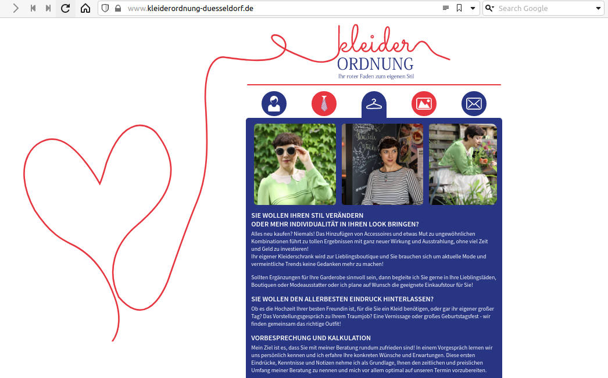
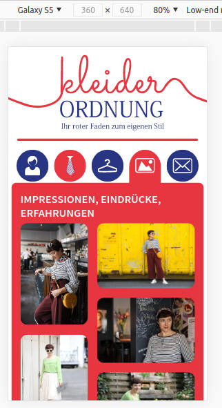
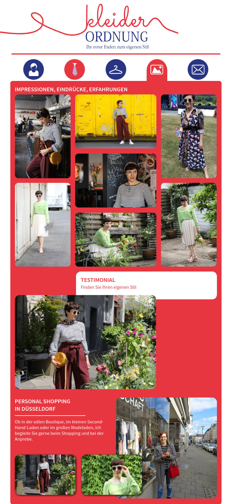

# Kleiderordnung-Duesseldorf.de

Small business website as a responsive single page application.
Images and original design by Vivien Kruggel,
[web development by Ingo Steinke](https://www.ingo-steinke.de/) in 2016.

Content update in 2022/2023: contact information, teaser for upcoming [www.kleiderordnung-berlin.de](http://www.kleiderordnung-berlin.de/)

## SCREENSHOTS

### intro, large screen

### gallery page, mobile (emulated)

### gallery page, laptop

## DOMAINS

http://www.kleiderordnung-duesseldorf.de/

## DEPENDENCIES

### Development
* yarn or npm to build project

### Production
* Apache webserver (HTTP header settings in .htaccess)
* PHP (with email service, to send contact form)

## BUILD TARGETS

* **yarn run lint** run all syntax checks
  * **npm run lint-scripts** check script syntax only (JavaScript / ES6)
  * **npm run lint-styles**  check styles syntax only (CSS 3 / SASS)
* **yarn run build** create scripts and styles for deployment

